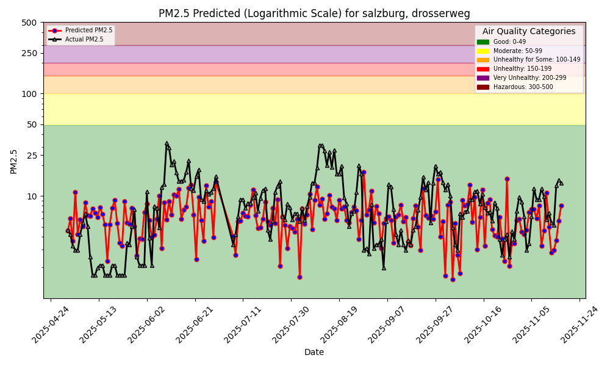
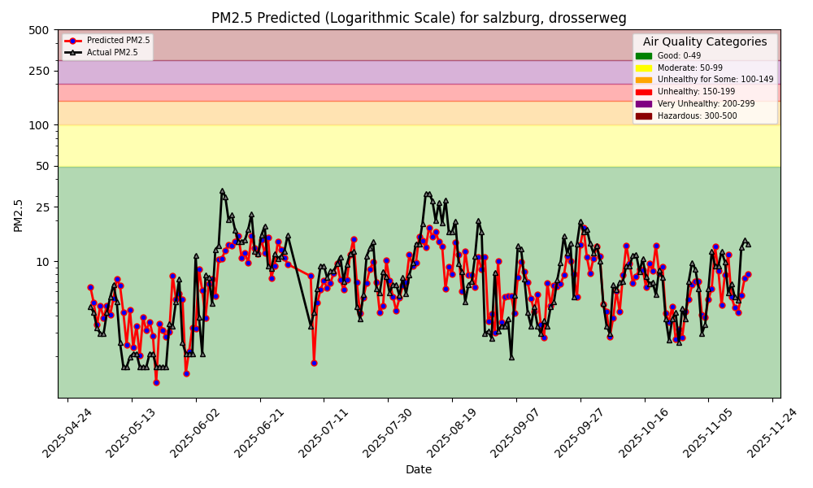

# Air quality prediction - Lab1 - Group CS

## Prediction dashboard

[Prediction dashboard](https://cimun.github.io/air-quality-prediction/)

## Work Done

- Relevant code was moved from interactive notebooks into modular Python scripts in the `scripts` directory. This makes
  the work easier to reuse, test and maintain, and gives each component a clear role.

- The build and maintenance workflow was updated. Both the `Makefile` and the `clean_hopsworks_resources` script were
  adapted to the new structure so development and deployment run in a consistent way.

- All processing scripts are now parameterized. Any number of measurement sites can be handled dynamically, and the
  sensors to process are defined in `sensors.csv`.

- A daily GitHub Actions pipeline runs the inference and feature-update scripts. This keeps the predictions and hindcast
  up to date without manual steps.

- A Hopsworks account was set up and the integration configured. The project stores data, models and predictions in Hopsworks.

- The base model was extended with three temporal lag features: `pm25_lag_1`, `pm25_lag_2` and `pm25_lag_3`. These
  features capture short term autocorrelations in the PM2.5 time series.

- Inference uses an iterative approach. For each forecast day, previously predicted PM2.5 values are fed back as lag
  features for the next day so multi-day forecasts remain consistent.

- Evaluation shows clear gains for short term forecasts. Long term performance dips in some cases, but hindcast analyses
  confirm the improvement on short horizons.

- The lagged model was further extended by extra meteorological features such as `surface_pressure`, `relative_humidity` and
  `cloud_cover`.

- The comparison below shows that each extension improved the model performance on the test set. While the addition of lagged
  PM2.5 features had the largest impact, the further weather features also contributed to a small but measurable gain.

## Model Comparison

*Basic default Model: MSE=43.4760 R2=\-0.0869*

*Basic model extended with lagged pm2.5 features: MSE=22.5421 R2=0.4365*

*Lagged model extended with further weather features: MSE=22.4638 R2=0.4384*